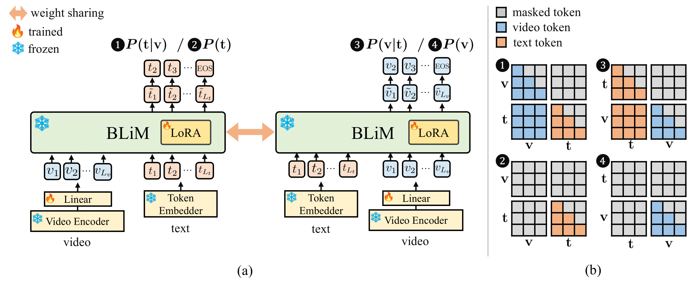

# Bidirectional Likelihood Estimation with Multi-Modal Large Language Models for Text-Video Retrieval

This is the official implementation of BLiM (ICCV 2025 **Highlight**).

> Dohwan Ko<sup>1*</sup>, Ji Soo Lee<sup>1*</sup>, Minhyuk Choi<sup>1</sup>, Zihang Meng<sup>2</sup>, Hyunwoo J. Kim<sup>3</sup>.
>
> <sup>1</sup>Korea University   <sup>2</sup>Meta GenAI   <sup>3</sup>KAIST


<p align="center">
  <a href="https://arxiv.org/abs/2507.23284"></a>
	<a href="https://huggingface.co/datasets/ikodoh/BLiM-Data"></a>
  <a href="https://ikodoh.github.io/BLiM"></a>
</p>


<div align="center">
  
</div>

## Setup
To install requirements, run:
```
git clone https://github.com/mlvlab/BLiM.git
cd BLiM
conda create -n blim python=3.11
conda activate blim
bash setup.sh
```


## Dataset

#### Quick start

* You can download the preprocessed video features and annotations for the following datasets: **DiDeMo**, **ActivityNet**, **LSMDC**, and **MSRVTT** [here](https://huggingface.co/datasets/ikodoh/BLiM-Data).

#### Long start

* After downloading the videos for each dataset, use `extract.py` to extract video features.

  ```
  CUDA_VISIBLE_DEVICES=0 python extract.py --dataset DiDeMo --batch_size 16 --num_chunk 4 --chunk_idx 0
  
  CUDA_VISIBLE_DEVICES=1 python extract.py --dataset DiDeMo --batch_size 16 --num_chunk 4 --chunk_idx 1
  
  CUDA_VISIBLE_DEVICES=2 python extract.py --dataset DiDeMo --batch_size 16 --num_chunk 4 --chunk_idx 2
  
  CUDA_VISIBLE_DEVICES=3 python extract.py --dataset DiDeMo --batch_size 16 --num_chunk 4 --chunk_idx 3
  ```

* This will launch feature extraction on 4 GPUs in parallel. To use a different number of GPUs, adjust the `--num_chunk` and `--chunk_idx` arguments accordingly.

* You can also use `extract.py` to extract video features from your **own dataset**. Simply modify the `--dataset` argument and ensure the videos are organized in the expected format.

---

* **Directory structure:** After preparing the video features and annotations, place them under the `./data/` directory as shown below:

  ```
  ./data
     └─ DiDeMo
         |─ features
         |   └─ ...
         |─ videos # (optional) only for long start 
         |   └─ ...
         |─ didemo_ret_train.json
         └─ didemo_ret_test.json
         
     └─ ActivityNet
         |─ features
         |   └─ ...
         |─ videos # (optional) only for long start
         |   └─ ...
         |─ anet_ret_train.json
         └─ anet_ret_val_1.json
         
     └─ LSMDC
      	:
     			
     └─ MSRVTT
      	:
  ```
  
  

## InternVideo2 Score Preparation

* We provide pre-extracted retrieval scores from **InternVideo2 1B** [here](https://huggingface.co/datasets/ikodoh/BLiM-Data).

* After downloading, place the `scores` folder is located at the root of your project directory.

  

## VideoChat-Flash Preparation

```shell
mkdir pretrained
cd pretrained
git lfs install
git clone https://huggingface.co/OpenGVLab/VideoChat-Flash-Qwen2-7B_res448
```


## Training BLiM

### DiDeMo

```shell
torchrun --rdzv_endpoint 127.0.0.1:1234 --nproc_per_node 8 \
main.py --batch_size 4 --batch_size_eval 16 --epochs 5 --warmup_epochs 1 --dataset DiDeMo --topk 16 \
--lr 2e-4 --weight_decay 1e-0 --output_dir ./checkpoint/didemo/blim --accum_iter 1 --cpn --alpha 0.0 0.8 --c 0.9 0.2 0.9 0.9
```

### ActivityNet

```shell
torchrun --rdzv_endpoint 127.0.0.1:1234 --nproc_per_node 8 \
main.py --batch_size 2 --batch_size_eval 16 --epochs 5 --warmup_epochs 1 --dataset ActivityNet --topk 16 \
--lr 2e-4 --weight_decay 1e-0 --output_dir ./checkpoint/activitynet/blim --accum_iter 2 --cpn --alpha 0.2 0.9 --c 1.0 0.4 0.9 0.8
```

### LSMDC

```shell
torchrun --rdzv_endpoint 127.0.0.1:1234 --nproc_per_node 8 \
main.py --batch_size 4 --batch_size_eval 16 --epochs 3 --warmup_epochs 1 --dataset LSMDC --topk 16 \
--lr 1e-4 --weight_decay 1e-0 --output_dir ./checkpoint/lsmdc/blim --accum_iter 8 --cpn --alpha 0.2 1.0 --c 1.0 0.6 0.9 0.6
```

### MSRVTT

```shell
torchrun --rdzv_endpoint 127.0.0.1:1234 --nproc_per_node 8 \
main.py --batch_size 4 --batch_size_eval 16 --epochs 3 --warmup_epochs 1 --dataset MSRVTT --topk 16 \
--lr 1e-4 --weight_decay 1e-0 --output_dir ./checkpoint/msrvtt/blim --accum_iter 16 --cpn --alpha 0.0 0.9 --c 1.0 0.6 0.8 0.4
```

* You can download our fine-tuned checkpoints [here](https://huggingface.co/datasets/ikodoh/BLiM-Data). After downloading, place the `checkpoint` folder in your working directory.


## Evaluation
* To evaluate a **fine-tuned model**, run the training script with the following arguments:

  ```shell
  --eval --resume ./your/checkpoint.pth
  ```

* For **zero-shot evaluation**, simply add ```--eval```. We recommend adjusting the `--alpha` and `--c` values, which control the weights for **CPN** and ensemble with **InternVideo2**, respectively.

  ```shell
  # DiDeMo
  --alpha 0.0 0.9 --c 1.0 0.0 0.9 0.9
  
  # ActivityNet
  --alpha 0.0 0.9 --c 1.0 0.0 0.9 0.8
  
  # LSMDC
  --alpha 0.0 0.9 --c 1.0 0.0 0.9 0.8
  
  # MSRVTT
  --alpha 0.0 0.8 --c 1.0 0.0 0.8 0.6
  ```

  

## Acknowledgements

This repo is built upon [Flipped-VQA](https://github.com/mlvlab/Flipped-VQA).


## Citations

```
@inproceedings{ko2025bidirectional,
  title={Bidirectional Likelihood Estimation with Multi-Modal Large Language Models for Text-Video Retrieval},
  author={Ko, Dohwan and Lee, Ji Soo and Choi, Minhyuk and Meng, Zihang and Kim, Hyunwoo J},
  booktitle={ICCV},
  year={2025}
}
```